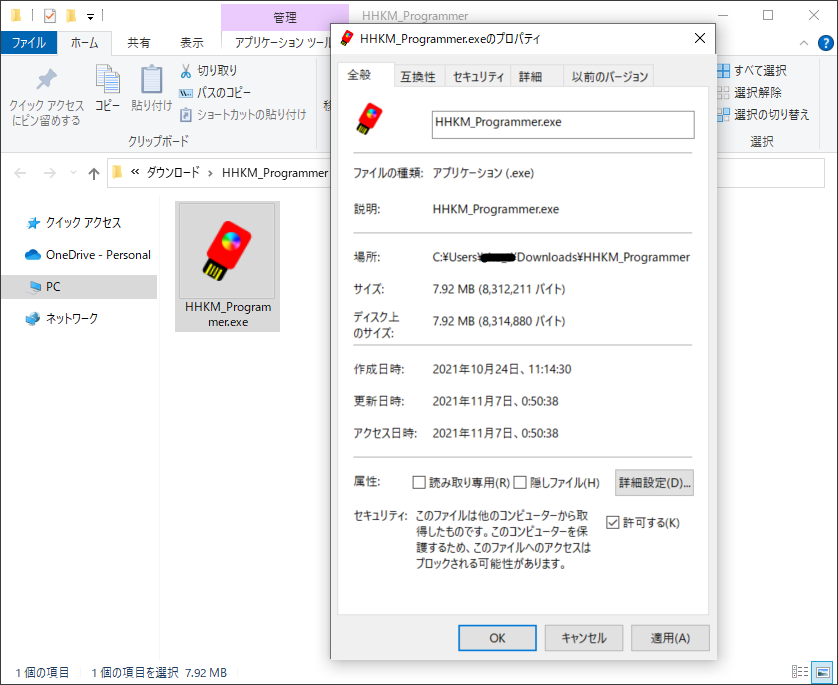

 # ヘルプ
 ## 「WindowsによってPCが保護されました」と表示され、アプリを実行できない場合。
 * HHKM_Programmer.zipを解凍し、HHKM_Programmer.exeを右クリック、プロパティー、セキュリティーの項目の許可するにチェックし、適用、OK。

 ## アプリにてConnectがOpen failedの場合
* HHKMをPCに接続していない場合は接続してください。

 ## HHKMを接続したがアプリから認識されない場合
* 選択したCOMポートが間違えている可能性があります。別のCOMポートを選択してください。
* 一度HHKMをPCから抜き、もう一度接続し試してください。接続時にマウスポインタが星形に動くことを確認してください。

 ## PrintScreenキーを使用したい場合
* Windowsの検索窓で「printscreen」と検索し、「PrintScreenキーを使用して画面の領域の切り取りを起動する」から、「プリントスクリーンのショートカット」の「PrtScnボタンを使用して画面領域切り取りを開く」をオンにしてください。
スクリーンショット画像は、「ピクチャ」フォルダ内の「スクリーンショット」フォルダに保存されます。