# macOS使用方法とサンプル
## macOS用アプリをダウンロード
リリースページからHHKM_Programmer.app.zipをダウンロードしてください。

## セキュリティー設定
1. ダウンロードしたアプリHHKM_Programmer.appをダブルクリック実行。
2. 「悪質なアプリかどうかをAppleでは確認できないため、このソフトウェアを開けません。」と表示される。「OK」を押していったん閉じる。
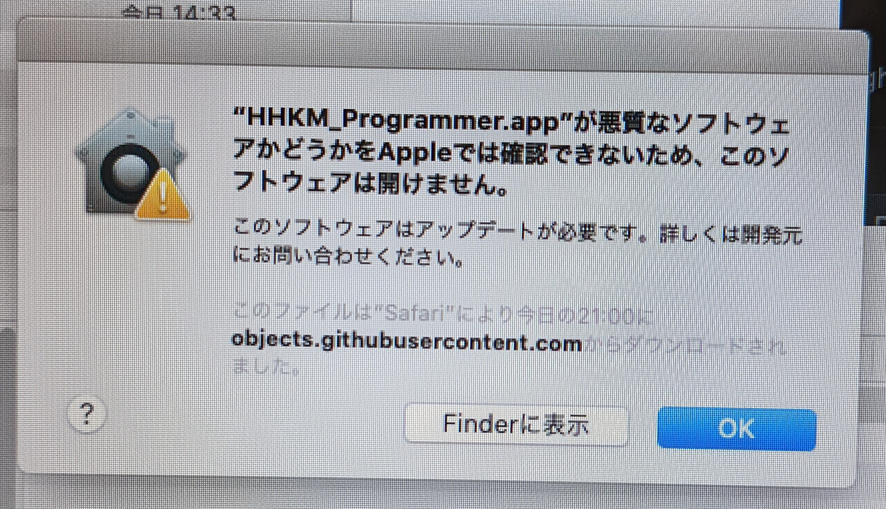
3. 「システム環境設定」→「セキュリティーとプライバシー」の「一般」タブを開く
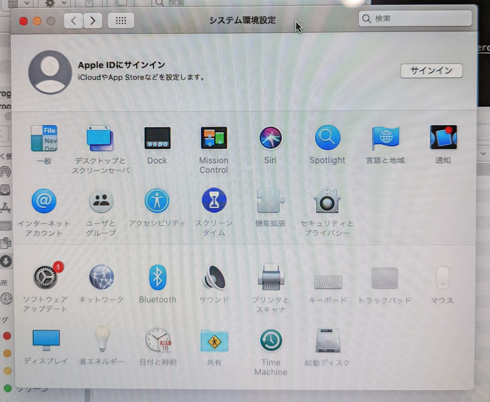
4. 「"HHKM_Programmer.app"は開発元を確認できないため、使用がブロックされました。」の横の、「このまま開く」を選択。
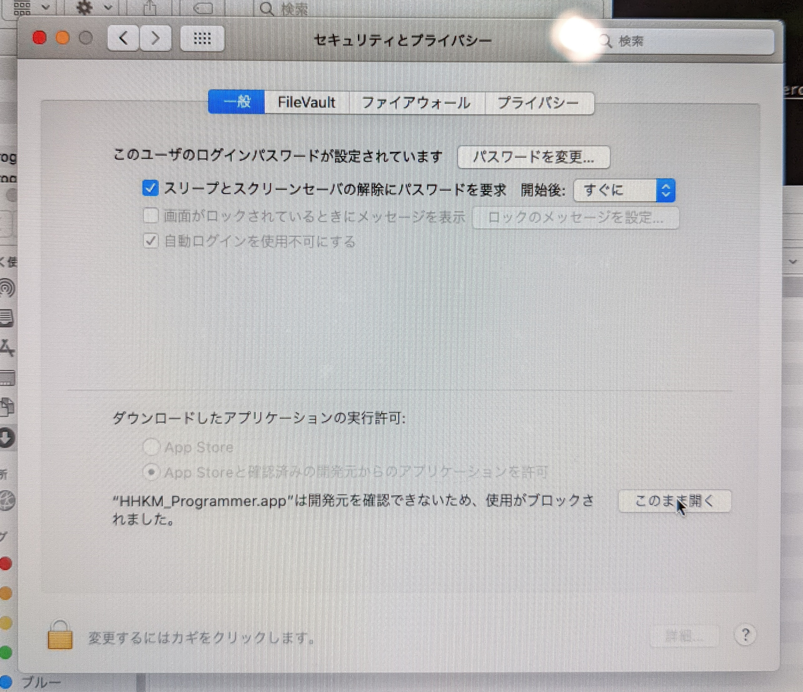
5. 再度、「悪質なアプリかどうかをAppleでは確認できないため、このソフトウェアを開けません。」と表示されるが、今度は「開く」を選択できるようになっており、起動できる。
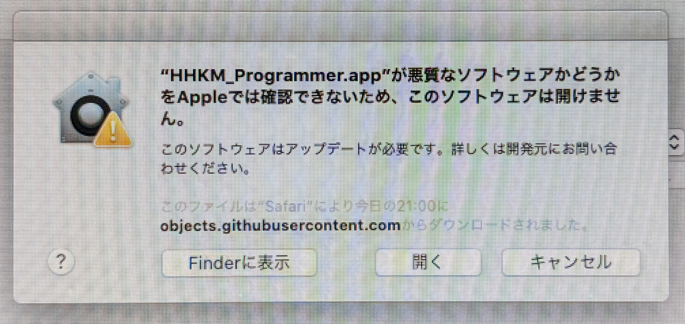
* この設定を一度行えば、当アプリは今後通常通りダブルクリックで起動できます。
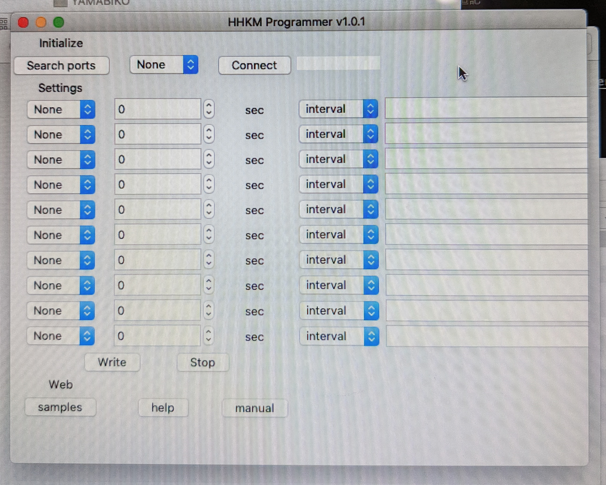

## HHKMを初めてMacに接続する際
初回接続時Appleキーボードかどうかを確認されるが、関係ないので確認を中断してください。

## HHKM_Programmer.appからのデバイス選択
macOSの場合、HHKM(USBデバイス自体)をUSBポートに接続し「Search ports」ボタンを押すと、
「/dev/cu.usbmodem14101」
のようなデバイスが選択可能になります。選択し、「Connect」ボタンで接続してください。
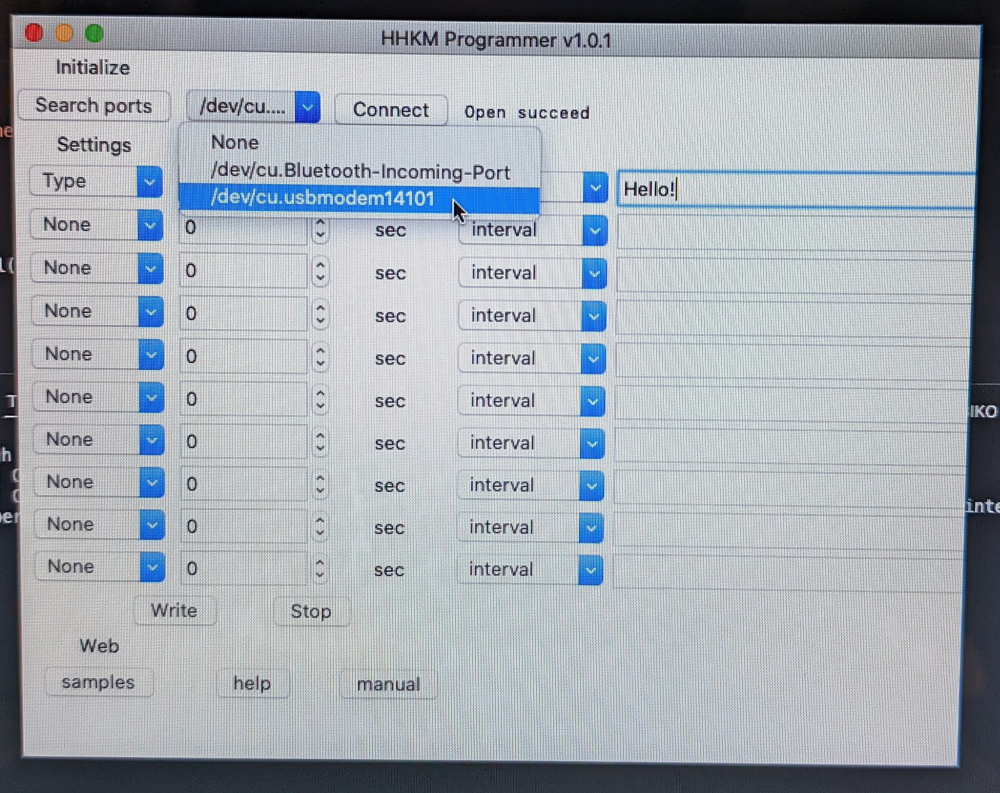

## macOS用サンプル
### 10秒間隔でマウス右クリック
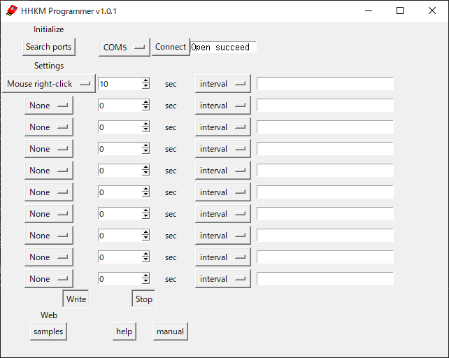
### 10秒間隔でマウス左クリック
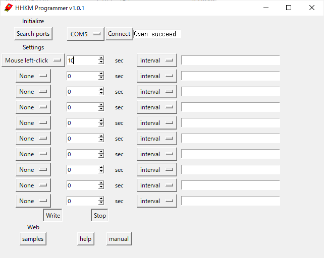
### テキストファイルに文字を記入
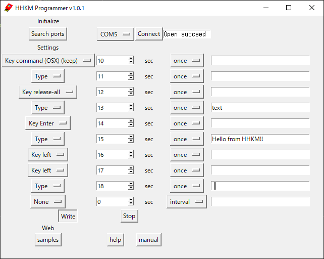
### ログアウト
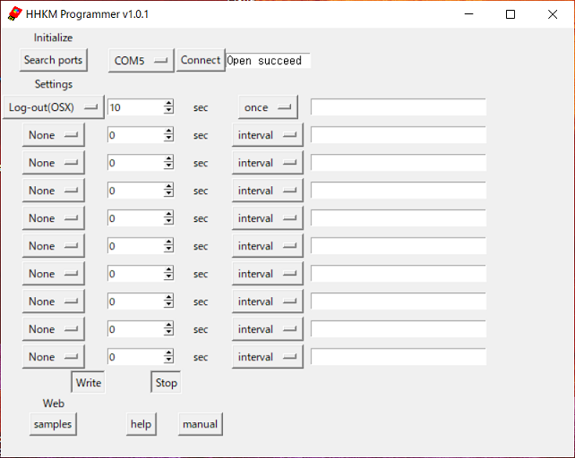
### command + スペースバー ショートカットでSpotlight検索フィールドからterminalを起動
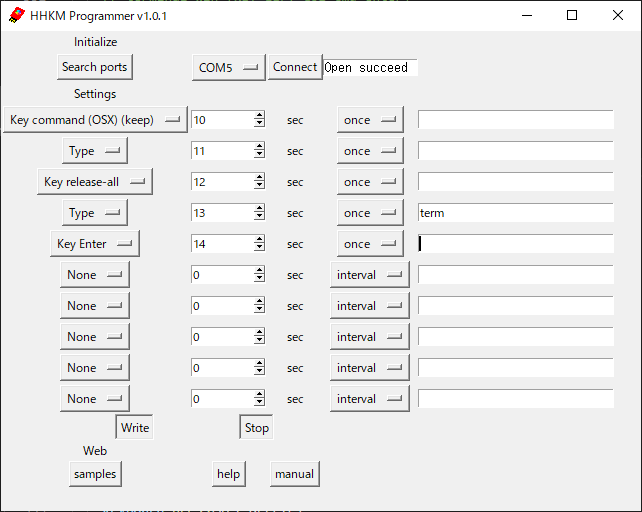
### command + G ショートカットで、「次を検索」
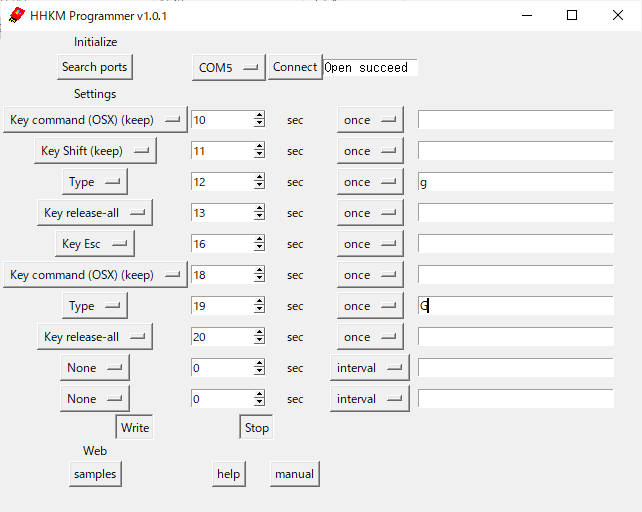

USBハブでも動作確認済み。

## 動作確認済み機種
* 機種名：MacBook Air
* 機種ID：MacBookAir7,2
* macOS Catalina バージョン 10.15.7
* macOS Monterey バージョン 12.2.1