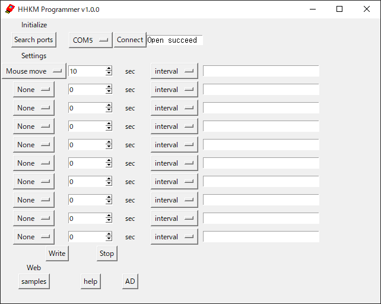
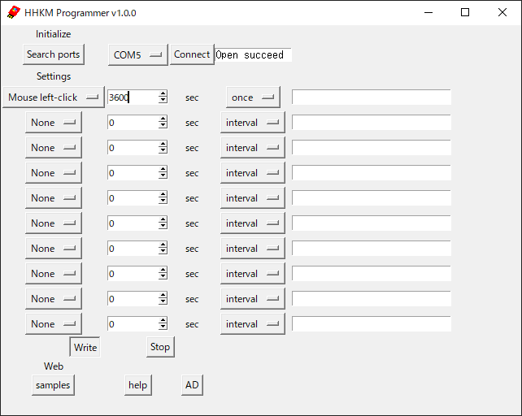
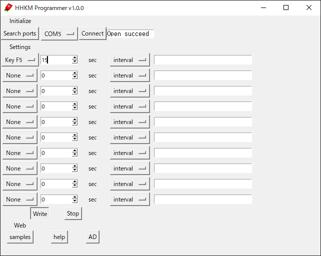
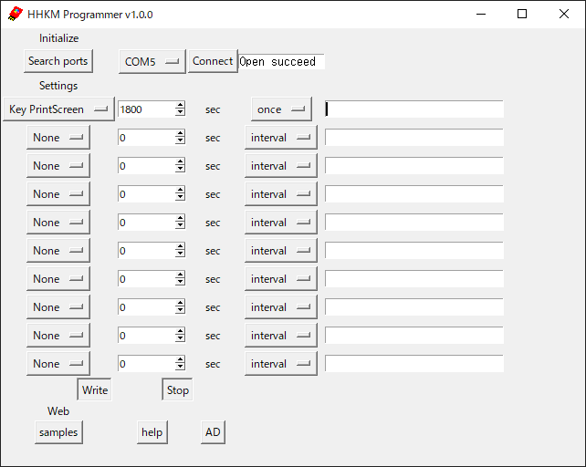
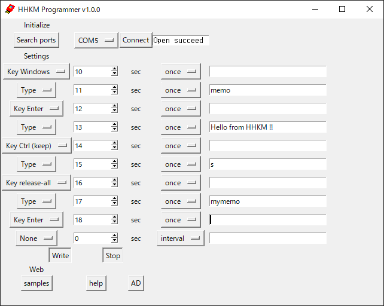
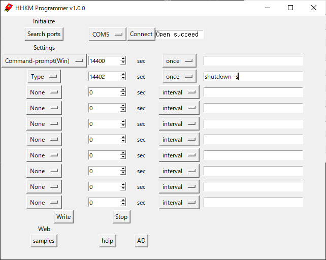

 # サンプル
 ## 10秒ごとにマウスを1ピクセル往復
 * スクリーンセーバーやログアウトを防ぐ。
 * ログインパスワードを入力する面倒を防ぐ。
 * ログアウトされて保存していなかったファイルが失われることを防ぐ。
 * 長時間のダウンロードが、止まってしまうことを防ぐ。
 * リモートデスクトップ接続が切れることを防ぐ。

 ## 1時間後にマウスクリック
 * メール送信ボタンを押す。
 * 応募ボタンを押す。
 
 
 ## 15秒ごとにF5を押し、ウェブサイトを再読み込み
 
 ## 2時間後にログアウト
 
 ## 8時間後に(上を数回押し)ログインパスワードを入力してエンターでログイン
 
 ## 30分後に画面のスクリーンショットを保存
 
 ## メモを記入して名前を付けて保存
 
 ## 4時間後にコマンドプロンプトを起動してPCの電源を切る
 

 # コマンド一覧
|command|動作|
|--|--|
|Mouse left-click|マウス左クリック|
|Mouse right-click|マウス右クリック|
|Mouse move|マウスカーソルを1ピクセル往復|
|Key up|上矢印「↑」押下|
|Key down|下矢印「↓」押下|
|Key left|左矢印「←」押下|
|Key right|右矢印「→」押下|
|Key Tab|Tabキー押下|
|Key Esc|Escキー押下|
|Key F2|F2キー押下|
|Key F5|F5キー押下|
|Key PrintScreen|PrintScreenキー押下|
|Key Windows|Windowsキー押下|
|Key command (OSX)|commandキー押下(OSX)|
|Key command (Linux)|commandキー押下(Linux)|
|Key Enter|Enterキー押下|
|Key Shift (keep)|Shiftキー保持|
|Key Ctrl (keep)|Ctrlキー保持|
|Key Alt (keep)|Altキー保持|
|Key Del (keep)|Delキー保持|
|Key command (OSX) (keep)|commandキー保持|
|Key release-all|保持しているキーをすべて離す|
|Type|登録された半角英数字を入力(,;:は使用不可)(1行につき64文字以内)|
|Command-prompt(Win)|windowsのコマンドプロンプトを開く|
|Terminal(OSX)|terminalを開く(OSX)  # (command-N)|
|Terminal(Linux)|terminalを開く(OSX)  # (ctrl-alt-t)|
|Log-out(Win)|ログアウト(windows)  # (ctrl-alt-del down down enter)|
|Log-out(OSX)|ログアウト(OSX)  # (command-Shift-Q enter)|
|Log-out(Linux)|ログアウト(Linux)  # (ctrl-alt-del enter)|